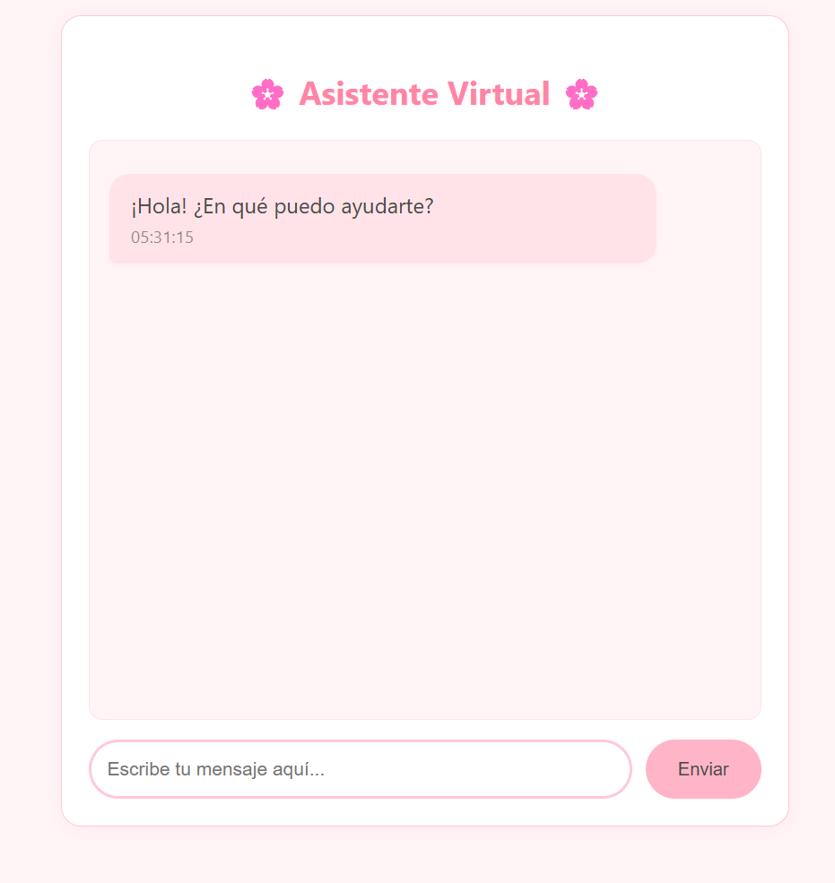

# 🌸 E-commerce Chatbot Assistant



Un chatbot asistente virtual para e-commerce desarrollado con Django, diseñado para proporcionar una experiencia de usuario amigable y elegante. El asistente puede ayudar con consultas sobre productos, precios, envíos y métodos de pago.

## ✨ Características Principales

- 💬 Interfaz de chat intuitiva y atractiva
- 🛍️ Catálogo de productos con precios actualizados
- 🚚 Información detallada sobre envíos
- 💳 Detalles sobre métodos de pago
- 🎨 Diseño responsivo y estético
- ⚡ Respuestas rápidas y precisas


## 🛠️ Tecnologías Utilizadas

- **Backend:** Django 4.2
- **Frontend:** JavaScript, HTML5, CSS3
- **Base de Datos:** SQLite
- **Estilos:** CSS Variables, Flexbox, Grid
- **Animaciones:** CSS Keyframes

## 🚀 Instalación Rápida

```bash
# Clonar el repositorio
git clone https://github.com/TU-USUARIO/ecommerce-chatbot.git

# Crear y activar entorno virtual
python -m venv venv
venv\Scripts\activate  # Windows
source venv/bin/activate  # Linux/Mac

# Instalar dependencias
pip install -r requirements.txt

# Realizar migraciones
python manage.py migrate

# Iniciar servidor
python manage.py runserver
